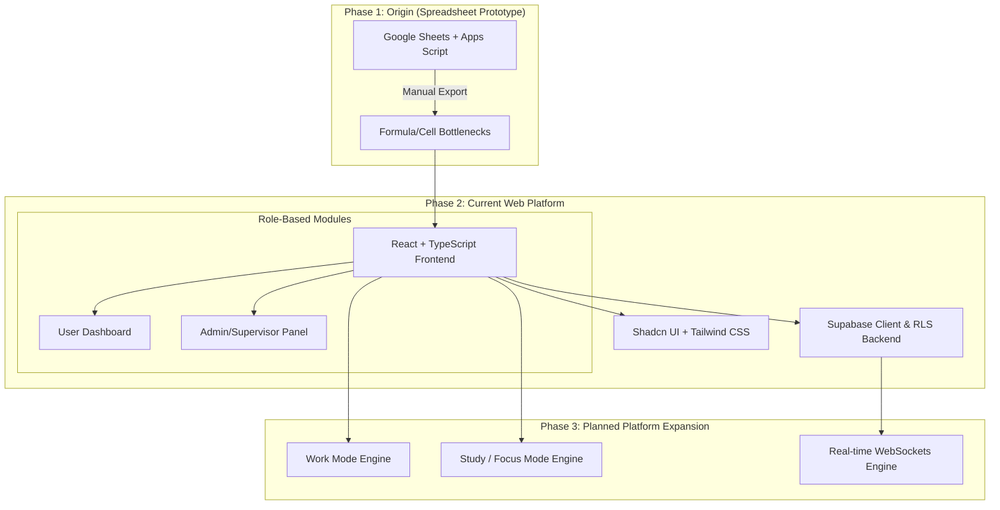

# Time Tracking Website

## Project Overview

This project provides a real-time tracking dashboard designed for small teams of 10–20 users to monitor the balance between active work and idle time. It features a live status board showing who is currently active or AFK (Away From Keyboard), alongside analytics that calculate average weekly performance metrics. By translating user activity data into clear insights, it helps teams optimize workflows, balance workloads, and keep accurate operational records without the overhead of heavy enterprise software.

What began as a lightweight data-tracking spreadsheet has evolved into a fully responsive web application, with active development underway to expand into a multi-tenant client-server architecture featuring tailored Work and Study environments.

---

## Technical Evolution & Roadmap



### Phase 1: The Origin (Spreadsheet Prototype)
* **Goal:** Create a lightweight, real-time availability and activity logging tool to help management balance workloads, track context switching (e.g., active vs. away states), and consolidate automated timesheets.
* **Implementation:** Built using Google Sheets, integrated Apps Script macros (interactive "AFK" and "Back" action buttons), automated timesheet tab generation, and cell-level permissions for supervisory reporting.
* **Key Limitations & Technical Pivot Points:**
  * **Data Integrity Hazards:** Even with sheet protection, cell protection in Google Sheets could be bypassed or broken by bulk copy-pasting, exposing logs to accidental tampering.
  * **State Synchronization Latency:** Using Google Apps Script buttons created execution delays (2–5 seconds per state change), causing race conditions when multiple users toggled status simultaneously.
  * **Audit Log Immutability:** Google Sheets lacked a true, immutable append-only audit trail; past time entries could not be securely locked down at scale without complex scripting.
  * **Scalability & UX Bottlenecks:** Spreadsheet UI could not dynamically adapt to user roles (e.g., hiding supervisory views cleanly from standard employees without maintaining separate workbooks).

### Phase 2: The Web App (Current Stage)
* **Goal:** Re-architect the prototype into an event-driven web application to eliminate latency, secure user logs, and deliver dynamic role-based dashboards.
* **Implementation:** Built using React, TypeScript, Tailwind CSS, and Shadcn UI, with Supabase integration for Row-Level Security (RLS) data persistence.
* **Key Solutions Introduced:**
  * **Zero-Latency State Switching:** Replaced slow Apps Script execution with instant client-side status toggles ("Active" vs. "AFK").
  * **Role-Based Access Control (RBAC):** Built distinct interfaces for Employees (personal time tracking) and Supervisors/Admins (team compliance monitoring and analytics).
  * **Immutable Database Logging:** Moved away from raw spreadsheet cells to append-only timestamp logs stored in PostgreSQL via Supabase.

### Phase 3: Platform Architecture & Expansion (In Progress)
* **Goal:** Scale from a single-client tracking web tool to a context-aware productivity platform.
* **Planned Features:**
  * **Work Mode:** High-efficiency interface focused on task queues, meeting integration, and active work metrics.
  * **Study Mode:** Focused workspace equipped with Pomodoro timers, flashcard generators, and distraction-blocking modules.
  * **Real-time Engine:** WebSocket and push notification engine for instant team status updates across all connected clients.

---

## 🛠️ Credits & Authors

* **Maica** ([@j0018](https://github.com/j0018)) - Core Developer & Project Creator
* **Figma Make** - UI/UX Design & Wireframing

---

## 🚀 Running the Code

### Prerequisites
* Node.js (v18+)
* npm or pnpm

### Installation & Local Setup

1. **Install dependencies:**
   ```bash
   npm install


